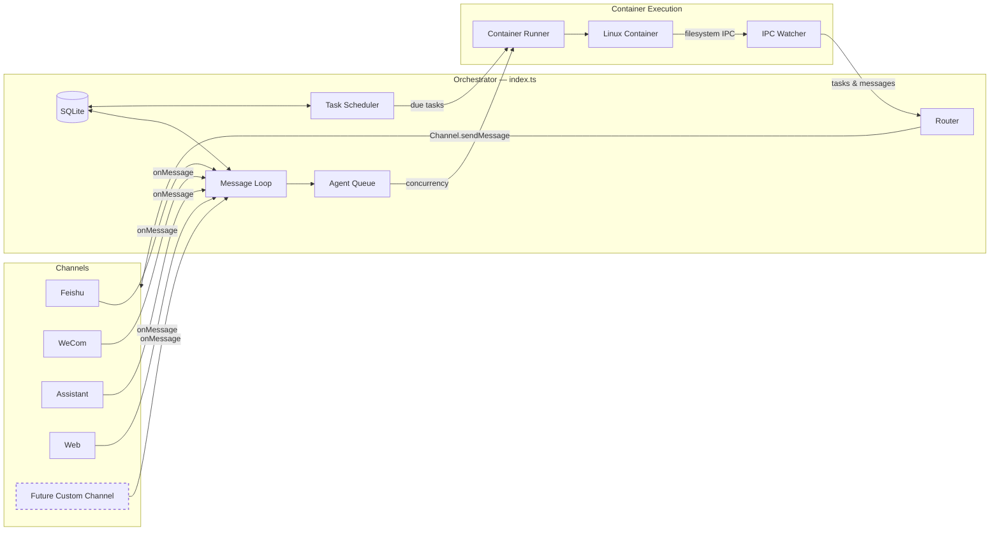

# Icarus Specification

A personal Claude assistant with multi-channel support, persistent memory per conversation, scheduled tasks, and container-isolated agent execution.

This specification describes the current internal experiment; it is not a public product contract. Normative language defines consistency inside the current checkout only. It does not imply an external compatibility guarantee, production certification, SLA, or obligation to preserve an unused interface. Freeze, release, activation, and audit behavior is justified only by local iteration stability and protection of local state. See [`internal-experimental-scope.md`](internal-experimental-scope.md).

The specification is latest-only: when a protocol, schema, API, event, Git layout, or local store model is replaced, this document and the active implementation describe only the new current version. Obsolete versions are rejected rather than migrated, dual-written, or replayed. Stale development state requires an explicit, narrowly scoped reinitialization. This policy must be replaced by an explicit compatibility policy before any irreplaceable history or external client dependency exists.

The Host runs only from a local Git checkout. Setup, TypeScript output, service-manager configuration, mutable project state, and optional rollback snapshots are anchored to that checkout. Electron clients are checkout-built local clients of the same Host; there is no supported standalone application package, bundled Host, packaged-install migration, or auto-update topology.

---

## Table of Contents

1. [Architecture](#architecture)
2. [Architecture: Channel System](#architecture-channel-system)
3. [Folder Structure](#folder-structure)
4. [Configuration](#configuration)
5. [Memory System](#memory-system)
6. [Session Management](#session-management)
7. [Message Flow](#message-flow)
8. [Commands](#commands)
9. [Scheduled Tasks](#scheduled-tasks)
10. [MCP Servers](#mcp-servers)
11. [Deployment](#deployment)
12. [Security Considerations](#security-considerations)

---

## Architecture

```
┌──────────────────────────────────────────────────────────────────────┐
│                        HOST (macOS / Linux)                           │
│                     (Main Node.js Process)                            │
├──────────────────────────────────────────────────────────────────────┤
│                                                                       │
│  ┌──────────────────┐                  ┌────────────────────┐        │
│  │ Channels         │─────────────────▶│   SQLite Database  │        │
│  │ (self-register   │◀────────────────│   (messages.db)    │        │
│  │  at startup)     │  store/send      └─────────┬──────────┘        │
│  └──────────────────┘                            │                   │
│                                                   │                   │
│         ┌─────────────────────────────────────────┘                   │
│         │                                                             │
│         ▼                                                             │
│  ┌──────────────────┐    ┌──────────────────┐    ┌───────────────┐   │
│  │  Message Loop    │    │  Scheduler Loop  │    │  IPC Watcher  │   │
│  │  (polls SQLite)  │    │  (checks tasks)  │    │  (file-based) │   │
│  └────────┬─────────┘    └────────┬─────────┘    └───────────────┘   │
│           │                       │                                   │
│           └───────────┬───────────┘                                   │
│                       │ spawns container                              │
│                       ▼                                               │
├──────────────────────────────────────────────────────────────────────┤
│                     CONTAINER (Linux VM)                               │
├──────────────────────────────────────────────────────────────────────┤
│  ┌──────────────────────────────────────────────────────────────┐    │
│  │                    AGENT RUNNER                               │    │
│  │                                                                │    │
│  │  Working directory: /workspace/agent (mounted from host)       │    │
│  │  Volume mounts:                                                │    │
│  │    • agents/{name}/ → /workspace/agent                         │    │
│  │    • data/attachments/ → /workspace/attachments                 │    │
│  │    • data/ai-images/ → /workspace/ai-images                     │    │
│  │    • agents/global/ → /workspace/global/ (non-main only)       │    │
│  │    • data/sessions/{agent}/.claude/ → /home/node/.claude/      │    │
│  │    • Additional dirs → /workspace/extra/*                      │    │
│  │                                                                │    │
│  │  Tools (all Agents):                                           │    │
│  │    • Bash (safe - sandboxed in container!)                     │    │
│  │    • Read, Write, Edit, Glob, Grep (file operations)           │    │
│  │    • WebSearch, WebFetch (internet access)                     │    │
│  │    • agent-browser (browser automation)                        │    │
│  │    • mcp__icarus__* (scheduler tools via IPC)                │    │
│  │                                                                │    │
│  └──────────────────────────────────────────────────────────────┘    │
│                                                                       │
└───────────────────────────────────────────────────────────────────────┘
```

### Technology Stack

| Component          | Technology                                    | Purpose                                   |
| ------------------ | --------------------------------------------- | ----------------------------------------- |
| Channel System     | Channel registry (`src/channels/registry.ts`) | Channels self-register at startup         |
| Message Storage    | SQLite (better-sqlite3)                       | Store messages for polling                |
| Container Runtime  | Containers (Linux VMs)                        | Isolated environments for agent execution |
| Agent              | @anthropic-ai/claude-agent-sdk (0.2.29)       | Run Claude with tools and MCP servers     |
| Browser Automation | agent-browser + Chromium                      | Web interaction and screenshots           |
| Runtime            | Node.js 20+                                   | Host process for routing and scheduling   |

---

## Architecture: Channel System

The core ships with Feishu, WeCom, Assistant, and Web. These channel modules self-register at startup; credentialed channels return no instance when required configuration is absent. Telegram is not currently supported, but a fork can add it through code customization using the same registry contract.

### System Diagram



### Channel Registry

The channel system is built on a factory registry in `src/channels/registry.ts`:

```typescript
export type ChannelFactory = (opts: ChannelOpts) => Channel | null;

const registry = new Map<string, ChannelFactory>();

export function registerChannel(name: string, factory: ChannelFactory): void {
  registry.set(name, factory);
}

export function getChannelFactory(name: string): ChannelFactory | undefined {
  return registry.get(name);
}

export function getRegisteredChannelNames(): string[] {
  return [...registry.keys()];
}
```

Each factory receives `ChannelOpts` (callbacks for `onMessage`, `onChatMetadata`, and `registeredAgents`) and returns either a `Channel` instance or `null` if that channel's credentials are not configured.

### Channel Interface

Every channel implements this interface (defined in `src/types.ts`):

```typescript
interface Channel {
  name: string;
  connect(): Promise<void>;
  sendMessage(jid: string, text: string): Promise<void>;
  isConnected(): boolean;
  ownsJid(jid: string): boolean;
  disconnect(): Promise<void>;
  setTyping?(jid: string, isTyping: boolean): Promise<void>;
}
```

### Self-Registration Pattern

Channels self-register using a barrel-import pattern:

1. Each channel file calls `registerChannel()` at module load time. For example:

   ```typescript
   // src/channels/feishu.ts
   import { registerChannel, ChannelOpts } from './registry.js';

   export class FeishuChannel implements Channel {
     /* ... */
   }

   registerChannel('feishu', (opts: ChannelOpts) => {
     // Return null if credentials are missing
     if (!hasFeishuCredentials()) return null;
     return new FeishuChannel(opts);
   });
   ```

2. The barrel file `src/channels/index.ts` imports all channel modules, triggering registration:

   ```typescript
   import './feishu.js';
   import './wecom.js';
   import './assistant.js';
   import './web.js';
   ```

3. At startup, the orchestrator (`src/index.ts`) loops through registered channels and connects whichever ones return a valid instance:

   ```typescript
   for (const name of getRegisteredChannelNames()) {
     const factory = getChannelFactory(name);
     const channel = factory?.(channelOpts);
     if (channel) {
       await channel.connect();
       channels.push(channel);
     }
   }
   ```

### Key Files

| File                       | Purpose                                                 |
| -------------------------- | ------------------------------------------------------- |
| `src/channels/registry.ts` | Channel factory registry                                |
| `src/channels/index.ts`    | Barrel imports that trigger channel self-registration   |
| `src/types.ts`             | `Channel` interface, `ChannelOpts`, message types       |
| `src/index.ts`             | Orchestrator — instantiates channels, runs message loop |
| `src/router.ts`            | Finds the owning channel for a JID, formats messages    |

### Adding a New Channel

To add a new channel, contribute a skill to `.claude/skills/add-<name>/` that:

1. Adds a `src/channels/<name>.ts` file implementing the `Channel` interface
2. Calls `registerChannel(name, factory)` at module load
3. Returns `null` from the factory if credentials are missing
4. Adds an import line to `src/channels/index.ts`

Use the existing built-in channel modules as the reference. A custom Telegram integration is a future code customization, not a current runtime capability.

---

## Folder Structure

```
icarus/
├── CLAUDE.md                      # Project context for Claude Code
├── docs/
│   ├── SPEC.md                    # This specification document
│   ├── REQUIREMENTS.md            # Architecture decisions
│   └── SECURITY.md                # Security model
├── README.md                      # User documentation
├── package.json                   # Node.js dependencies
├── tsconfig.json                  # TypeScript configuration
├── .mcp.json                      # MCP server configuration (reference)
├── .gitignore
│
├── src/
│   ├── index.ts                   # Orchestrator: state, message loop, agent invocation
│   ├── channels/
│   │   ├── registry.ts            # Channel factory registry
│   │   └── index.ts               # Barrel imports for channel self-registration
│   ├── ipc.ts                     # IPC watcher and task processing
│   ├── router.ts                  # Message formatting and outbound routing
│   ├── config.ts                  # Configuration constants
│   ├── types.ts                   # TypeScript interfaces (includes Channel)
│   ├── logger.ts                  # Pino logger setup
│   ├── db.ts                      # SQLite database initialization and queries
│   ├── agent-queue.ts             # Per-agent queue with global concurrency limit
│   ├── mount-security.ts          # Mount allowlist validation for containers
│   ├── task-scheduler.ts          # Runs scheduled tasks when due
│   └── container-runner.ts        # Spawns agents in containers
│
├── container/
│   ├── Dockerfile                 # Container image (runs as 'node' user, includes Claude Code CLI)
│   ├── build.sh                   # Build script for container image
│   ├── agent-runner/              # Code that runs inside the container
│   │   ├── package.json
│   │   ├── tsconfig.json
│   │   └── src/
│   │       ├── index.ts           # Entry point (query loop, IPC polling, session resume)
│   │       └── ipc-mcp-stdio.ts   # Stdio-based MCP server for host communication
│   └── skills/
│       └── agent-browser.md       # Browser automation skill
│
├── dist/                          # Compiled JavaScript (gitignored)
│
├── .claude/
│   └── skills/
│       ├── debug/SKILL.md              # /debug - Container debugging
│       ├── manage-workflows/SKILL.md   # /manage-workflows - Workflow type configuration
│       └── setup/SKILL.md              # /setup - First-time installation
│
├── agents/
│   ├── CLAUDE.md                  # Global memory (all Agents read this)
│   ├── {channel}_main/             # Main control channel (e.g., web_main/)
│   │   ├── CLAUDE.md              # Main channel memory
│   │   └── logs/                  # Task execution logs
│   └── {channel}_{agent-name}/    # Per-agent folders (created on registration)
│       ├── CLAUDE.md              # Agent-specific memory
│       ├── logs/                  # Task logs for this agent
│       └── *.md                   # Files created by the agent
│
├── store/                         # Local data (gitignored)
│   └── messages.db                # SQLite database (messages, chats, scheduled_tasks, agent_queries, agent_query_steps, agent_query_events, registered_agents, sessions, router_state)
│
├── data/                          # Application state (gitignored)
│   ├── sessions/                  # Per-agent session data (.claude/ dirs with JSONL transcripts)
│   ├── env/env                    # Copy of .env for container mounting
│   └── ipc/                       # Container IPC (messages/, tasks/)
│
├── logs/                          # Runtime logs (gitignored)
│   ├── icarus.log                 # Host stdout
│   └── icarus.error.log           # Host stderr
│   # Note: Per-container logs are in agents/{folder}/logs/container-*.log
│
└── launchd/
    └── com.icarus.plist         # macOS service configuration
```

---

## Configuration

Configuration constants are in `src/config.ts`:

```typescript
import path from 'path';

export const ASSISTANT_NAME = process.env.ASSISTANT_NAME || 'Andy';
export const POLL_INTERVAL = 2000;
export const SCHEDULER_POLL_INTERVAL = 60000;

// Paths are absolute (required for container mounts)
const PROJECT_ROOT = process.cwd();
export const STORE_DIR = path.resolve(PROJECT_ROOT, 'store');
export const AGENTS_DIR = path.resolve(PROJECT_ROOT, 'agents');
export const DATA_DIR = path.resolve(PROJECT_ROOT, 'data');

// Container configuration
export const CONTAINER_IMAGE =
  process.env.CONTAINER_IMAGE || 'icarus-agent:latest';
export const CONTAINER_TIMEOUT = parseInt(
  process.env.CONTAINER_TIMEOUT || '1800000',
  10,
); // 30min default
export const IPC_POLL_INTERVAL = 1000;
export const IDLE_TIMEOUT = parseInt(process.env.IDLE_TIMEOUT || '1800000', 10); // 30min — keep container alive after last result
export const MAX_CONCURRENT_CONTAINERS = Math.max(
  1,
  parseInt(process.env.MAX_CONCURRENT_CONTAINERS || '5', 10) || 5,
);

export const TRIGGER_PATTERN = new RegExp(`^@${ASSISTANT_NAME}\\b`, 'i');
```

**Note:** Paths must be absolute for container volume mounts to work correctly.

### Container Configuration

Agents can have additional directories mounted via `containerConfig` in the SQLite `registered_agents` table (stored as JSON in the `container_config` column). Example registration:

```typescript
setRegisteredAgent('web:dev-team', {
  name: 'Dev Team',
  folder: 'web_dev-team',
  trigger: '@Andy',
  added_at: new Date().toISOString(),
  containerConfig: {
    additionalMounts: [
      {
        hostPath: '~/projects/webapp',
        containerPath: 'webapp',
        readonly: false,
      },
    ],
    timeout: 600000,
  },
});
```

Folder names follow the convention `{channel}_{agent-name}` (for example, `web_research` or `feishu_dev-team`). The main agent has `isMain: true` set during registration.

Additional mounts appear at `/workspace/extra/{containerPath}` inside the container.

**Mount syntax note:** Read-write mounts use `-v host:container`, but readonly mounts require `--mount "type=bind,source=...,target=...,readonly"` (the `:ro` suffix may not work on all runtimes).

### Claude Authentication

Configure authentication in a `.env` file in the project root. Two options:

**Option 1: Claude Subscription (OAuth token)**

```bash
CLAUDE_CODE_OAUTH_TOKEN=sk-ant-oat01-...
```

The token can be extracted from `~/.claude/.credentials.json` if you're logged in to Claude Code.

**Option 2: Pay-per-use API Key**

```bash
ANTHROPIC_API_KEY=sk-ant-api03-...
```

Only the authentication variables (`CLAUDE_CODE_OAUTH_TOKEN` and `ANTHROPIC_API_KEY`) are extracted from `.env` and written to `data/env/env`, then mounted into the container at `/workspace/env-dir/env` and sourced by the entrypoint script. This ensures other environment variables in `.env` are not exposed to the agent. This workaround is needed because some container runtimes lose `-e` environment variables when using `-i` (interactive mode with piped stdin).

### Changing the Assistant Name

Set the `ASSISTANT_NAME` environment variable:

```bash
ASSISTANT_NAME=Bot npm start
```

Or edit the default in `src/config.ts`. This changes:

- The trigger pattern (messages must start with `@YourName`)
- The response prefix (`YourName:` added automatically)

### Placeholder Values in launchd

Files with `{{PLACEHOLDER}}` values need to be configured:

- `{{PROJECT_ROOT}}` - Absolute path to your Icarus installation
- `{{NODE_PATH}}` - Path to node binary (detected via `which node`)
- `{{HOME}}` - User's home directory

---

## Memory System

Icarus uses a structured memory system backed by SQLite, plus transcript archiving.

### Memory Layers

| Layer       | Storage          | Purpose                        |
| ----------- | ---------------- | ------------------------------ |
| `working`   | `memories` table | Short-lived session context    |
| `episodic`  | `memories` table | Past events/summaries          |
| `canonical` | `memories` table | Stable preferences/rules/facts |

Each memory row has `status`: `active` / `conflicted` / `deprecated`.

### Search & Operations

- `memory_search`: hybrid retrieval from chat messages + structured memories
- `memory_write`, `memory_list`, `memory_update`, `memory_delete`: CRUD
- `memory_doctor`: detect duplicates/conflicts/stale working memory
- `memory_gc`: deduplicate and prune stale working memory
- `memory_metrics`: view operation metrics by event type

### Context Loading

1. Session continuity:
   - Session IDs are persisted in SQLite (`sessions` table)
   - Claude Agent SDK resumes with `resume`
2. Startup memory pack:
   - Before each new run, Icarus builds a budgeted memory pack from structured memory
   - Layer quotas: canonical > episodic > working
3. Global prompt context:
   - Non-main Agents read `agents/global/CLAUDE.md` as additional system prompt

### Transcript Archiving

- Archiving on container exit
- Archiving after successful `/compact`
- Periodic checkpoint archiving during long-running sessions

---

## Session Management

Sessions enable conversation continuity - Claude remembers what you talked about.

### How Sessions Work

1. Each agent has a session ID stored in SQLite (`sessions` table, keyed by `agent_folder`)
2. Session ID is passed to Claude Agent SDK's `resume` option
3. Claude continues the conversation with full context
4. Session transcripts are stored as JSONL files in `data/sessions/{agent}/.claude/`

---

## Message Flow

### Incoming Message Flow

```
1. User sends a message via any connected channel
   │
   ▼
2. The owning Feishu, WeCom, Assistant, or Web channel receives the message
   │
   ▼
3. Message stored in SQLite (store/messages.db)
   │
   ▼
4. Message loop polls SQLite (every 2 seconds)
   │
   ▼
5. Router checks:
   ├── Is chat_jid in registered Agents (SQLite)? → No: ignore
   └── Does message match trigger pattern? → No: store but don't process
   │
   ▼
6. Router catches up conversation:
   ├── Fetch all messages since last agent interaction
   ├── Format with timestamp and sender name
   └── Build prompt with full conversation context
   │
   ▼
7. Router invokes Claude Agent SDK:
   ├── cwd: agents/{agent-name}/
   ├── prompt: conversation history + current message
   ├── resume: session_id (for continuity)
   └── mcpServers: icarus (scheduler)
   │
   ▼
8. Claude processes message:
   ├── Reads CLAUDE.md files for context
   └── Uses tools as needed (search, email, etc.)
   │
   ▼
9. Router prefixes response with assistant name and sends via the owning channel
   │
   ▼
10. Router updates last agent timestamp and saves session ID
```

### Trigger Word Matching

Messages must start with the trigger pattern (default: `@Andy`):

- `@Andy what's the weather?` → ✅ Triggers Claude
- `@andy help me` → ✅ Triggers (case insensitive)
- `Hey @Andy` → ❌ Ignored (trigger not at start)
- `What's up?` → ❌ Ignored (no trigger)

### Conversation Catch-Up

When a triggered message arrives, the agent receives all messages since its last interaction in that chat. Each message is formatted with timestamp and sender name:

```
[Jan 31 2:32 PM] John: hey everyone, should we do pizza tonight?
[Jan 31 2:33 PM] Sarah: sounds good to me
[Jan 31 2:35 PM] John: @Andy what toppings do you recommend?
```

This allows the agent to understand the conversation context even if it wasn't mentioned in every message.

---

## Commands

### Commands Available in Any Agent

| Command                | Example                     | Effect         |
| ---------------------- | --------------------------- | -------------- |
| `@Assistant [message]` | `@Andy what's the weather?` | Talk to Claude |

### Commands Available in Main Channel Only

| Command                          | Example                             | Effect                 |
| -------------------------------- | ----------------------------------- | ---------------------- |
| `@Assistant add agent "Name"`    | `@Andy add agent "Family Chat"`     | Register a new agent   |
| `@Assistant remove agent "Name"` | `@Andy remove agent "Work Team"`    | Unregister an agent    |
| `@Assistant list Agents`         | `@Andy list Agents`                 | Show registered Agents |
| `@Assistant remember [fact]`     | `@Andy remember I prefer dark mode` | Add to global memory   |

---

## Scheduled Tasks

Icarus has a built-in scheduler that creates an Agent Run in the target Agent's context for each task.

### How Scheduling Works

1. **Agent Context**: Tasks run in an Agent Run with the target Agent's working directory and memory
2. **Full Agent Capabilities**: Scheduled tasks have access to all tools (WebSearch, file operations, etc.)
3. **Optional Messaging**: Tasks can send messages to their agent using the `send_message` tool, or complete silently
4. **Main Channel Privileges**: The main channel can schedule tasks for any agent and view all tasks

### Schedule Types

| Type       | Value Format    | Example                      |
| ---------- | --------------- | ---------------------------- |
| `cron`     | Cron expression | `0 9 * * 1` (Mondays at 9am) |
| `interval` | Milliseconds    | `3600000` (every hour)       |
| `once`     | ISO timestamp   | `2024-12-25T09:00:00Z`       |

### Creating a Task

```
User: @Andy remind me every Monday at 9am to review the weekly metrics

Claude: [calls mcp__icarus__schedule_task]
        {
          "prompt": "Send a reminder to review weekly metrics. Be encouraging!",
          "schedule_type": "cron",
          "schedule_value": "0 9 * * 1"
        }

Claude: Done! I'll remind you every Monday at 9am.
```

### One-Time Tasks

```
User: @Andy at 5pm today, send me a summary of today's emails

Claude: [calls mcp__icarus__schedule_task]
        {
          "prompt": "Search for today's emails, summarize the important ones, and send the summary to the agent.",
          "schedule_type": "once",
          "schedule_value": "2024-01-31T17:00:00Z"
        }
```

### Managing Tasks

From any agent:

- `@Andy list my scheduled tasks` - View tasks for this agent
- `@Andy pause task [id]` - Pause a task
- `@Andy resume task [id]` - Resume a paused task
- `@Andy cancel task [id]` - Delete a task

From main channel:

- `@Andy list all tasks` - View tasks from all Agents
- `@Andy schedule task for "Family Chat": [prompt]` - Schedule for another agent

---

## MCP Servers

### Built-in MCP Server

The `icarus` MCP server is created dynamically per agent call with the current agent's context.

**Available Tools:**
| Tool | Purpose |
|------|---------|
| `schedule_task` | Schedule a recurring or one-time task |
| `list_tasks` | Show tasks (agent's tasks, or all if main) |
| `get_task` | Get task details and run history |
| `update_task` | Modify task prompt or schedule |
| `pause_task` | Pause a task |
| `resume_task` | Resume a paused task |
| `cancel_task` | Delete a task |
| `send_message` | Send a message to the agent via its channel |

---

## Deployment

Icarus runs from the local Git checkout as a single macOS launchd service. The generated service entry records the checkout's absolute Host launcher and working directory. Moving the checkout requires rerunning setup; installing an application bundle is not an alternative deployment path.

### Startup Sequence

When Icarus starts, it:

1. **Ensures container runtime is running** - Automatically starts it if needed; kills orphaned project containers from previous runs
2. Initializes the current SQLite database; the existing development-only JSON-file importer is legacy behavior to remove under latest-only, not a supported migration contract
3. Loads state from SQLite (registered Agents, sessions, router state)
4. **Connects channels** — loops through registered channels, instantiates those with credentials, calls `connect()` on each
5. Once at least one channel is connected:
   - Starts the scheduler loop
   - Starts the IPC watcher for container messages
   - Sets up the per-Agent queue with `processAgentMessages`
   - Recovers any unprocessed messages from before shutdown
   - Starts the message polling loop

### Service: com.icarus

**launchd/com.icarus.plist:**

```xml
<?xml version="1.0" encoding="UTF-8"?>
<!DOCTYPE plist PUBLIC "-//Apple//DTD PLIST 1.0//EN" "...">
<plist version="1.0">
<dict>
    <key>Label</key>
    <string>com.icarus</string>
    <key>ProgramArguments</key>
    <array>
        <string>{{NODE_PATH}}</string>
        <string>{{PROJECT_ROOT}}/dist/index.js</string>
    </array>
    <key>WorkingDirectory</key>
    <string>{{PROJECT_ROOT}}</string>
    <key>RunAtLoad</key>
    <true/>
    <key>KeepAlive</key>
    <true/>
    <key>EnvironmentVariables</key>
    <dict>
        <key>PATH</key>
        <string>{{HOME}}/.local/bin:/usr/local/bin:/usr/bin:/bin</string>
        <key>HOME</key>
        <string>{{HOME}}</string>
        <key>ASSISTANT_NAME</key>
        <string>Andy</string>
    </dict>
    <key>StandardOutPath</key>
    <string>{{PROJECT_ROOT}}/logs/icarus.log</string>
    <key>StandardErrorPath</key>
    <string>{{PROJECT_ROOT}}/logs/icarus.error.log</string>
</dict>
</plist>
```

### Managing the Service

```bash
# Install service
cp launchd/com.icarus.plist ~/Library/LaunchAgents/

# Start service
launchctl bootstrap gui/$(id -u) ~/Library/LaunchAgents/com.icarus.plist

# Stop service
launchctl bootout gui/$(id -u)/com.icarus

# Check status
launchctl list | grep icarus

# View logs
tail -f logs/icarus.log
```

---

## Security Considerations

### Container Isolation

All agents run inside containers (lightweight Linux VMs), providing:

- **Filesystem isolation**: Agents can only access mounted directories
- **Safe Bash access**: Commands run inside the container, not on your Mac
- **Network isolation**: Can be configured per-container if needed
- **Process isolation**: Container processes can't affect the host
- **Non-root user**: Container runs as unprivileged `node` user (uid 1000)

### Prompt Injection Risk

Messages from any connected channel could contain malicious instructions attempting to manipulate Claude's behavior.

**Mitigations:**

- Container isolation limits blast radius
- Only registered Agents are processed
- Trigger word required (reduces accidental processing)
- Agents can only access their agent's mounted directories
- Main can configure additional directories per agent
- Claude's built-in safety training

**Recommendations:**

- Only register trusted Agents
- Review additional directory mounts carefully
- Review scheduled tasks periodically
- Monitor logs for unusual activity

### Credential Storage

| Credential          | Storage Location               | Notes                                               |
| ------------------- | ------------------------------ | --------------------------------------------------- |
| Claude CLI Auth     | data/sessions/{agent}/.claude/ | Per-agent isolation, mounted to /home/node/.claude/ |
| Channel credentials | `.env`                         | Host-only; never mounted into Agent containers      |

### File Permissions

The agents/ folder contains personal memory and should be protected:

```bash
chmod 700 agents/
```

---

## Troubleshooting

### Common Issues

| Issue                                    | Cause                             | Solution                                                                                 |
| ---------------------------------------- | --------------------------------- | ---------------------------------------------------------------------------------------- |
| No response to messages                  | Service not running               | Check `launchctl list \| grep icarus`                                                    |
| "Claude Code process exited with code 1" | Container runtime failed to start | Check logs; Icarus auto-starts container runtime but may fail                            |
| "Claude Code process exited with code 1" | Session mount path wrong          | Ensure mount is to `/home/node/.claude/` not `/root/.claude/`                            |
| Session not continuing                   | Session ID not saved              | Check SQLite: `sqlite3 store/messages.db "SELECT * FROM sessions"`                       |
| Session not continuing                   | Mount path mismatch               | Container user is `node` with HOME=/home/node; sessions must be at `/home/node/.claude/` |
| "No Agents registered"                   | Haven't added Agents              | Register an Agent through setup or the main Agent                                        |

### Log Location

- `logs/icarus.log` - stdout
- `logs/icarus.error.log` - stderr

### Debug Mode

Run manually for verbose output:

```bash
npm run dev
# or
node dist/index.js
```
