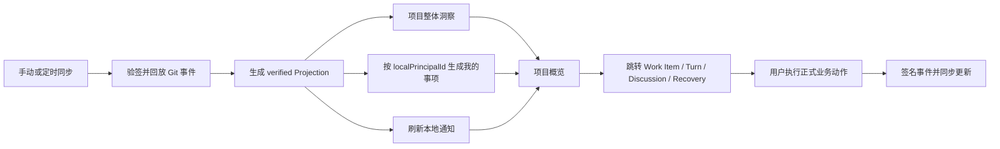
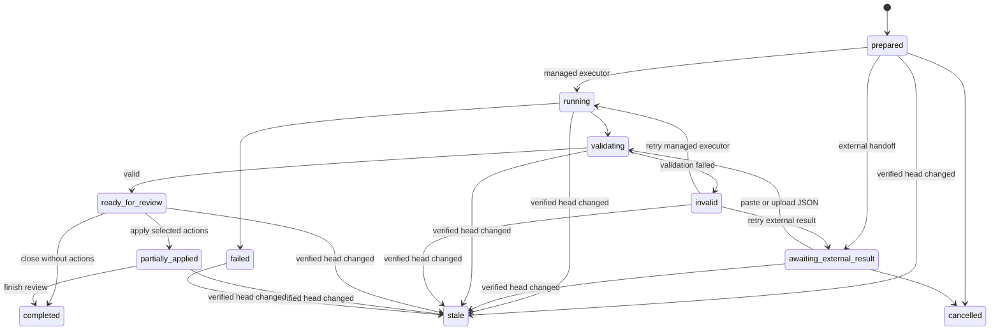

# Icarus 协作项目洞察与 Agent 分析优化方案

## 文档状态

- 状态：Proposed
- 日期：2026-08-08
- 适用范围：Collaboration Project Space v4、项目概览、我的事项、本地通知、Project Analyst、Executor、外部 Agent 接力
- 前置依赖：任务 `019fdffb-618a-7433-974c-74fa975f24cd` 完成返修、复核通过并合入 `main`
- 实施方式：前置依赖合入后，从最新 `main` 创建独立 worktree 和独立实施会话
- 版本原则：latest-only；当前没有需要兼容的真实群组、分析记录或历史协议数据，不实现旧版本迁移、双写或兼容读取
- 数据格式原则：机器协议和结构化数据使用 JSON；人类文档和 Prompt 使用 Markdown；业务文件保持自身格式
- 相关文档：
  - [Icarus 协作群组项目空间 v4 方案](collaboration-project-space-v4-plan.md)

本文档汇总并固化以下两类优化：

1. 用户进入群组后，能够快速了解项目当前状态以及所有与自己相关的事项。
2. 用户可以让本地或第三方 Agent 分析项目现状、发现问题并提出后续操作建议，同时由 Icarus 保持权限、证据、校验和执行闭环。

## 1. 摘要

当前 Collaboration v4 已经能够记录 Work Item、Workflow Instance、Turn、Discussion、Principal Workspace、文件、链接、通知和完整活动链，但用户仍需在多个页面之间手工查找信息：

- 项目整体是否健康；
- 当前有哪些逾期、阻塞或停滞问题；
- 哪些工作项、工作流节点、讨论和审批与自己相关；
- 自己下一步具体需要处理什么；
- 哪些潜在问题尚未被成员明确登记为 Work Item。

本方案增加两个相互配合的能力层：

```text
Verified Project Projection
  -> Project Insight（确定性汇总和规则检测）
  -> Project Analyst（Agent 推理和建议）
  -> User Review（用户审核）
  -> Fixed Business Actions（固定业务动作）
  -> Signed Collaboration Events（正式群组事实）
```

核心结论：

1. 群组默认页升级为“项目概览 + 我的事项”，不再只展示全局数量。
2. 与当前用户相关的事项由 `localPrincipalId` 和 verified Projection 确定性计算。
3. 通知提供可见明细、资源跳转、处理状态和自动关闭，不只显示一个数量。
4. Agent 分析先使用规则检测器生成可证明的事实信号，再进行跨资源推理。
5. Project Analyst 使用统一的能力包和 JSON Contract；Skill 是平台适配方式，不是核心协议。
6. 支持 Icarus 托管 Executor 和外部 Agent 手工接力两种执行渠道。
7. 外部接力必须绑定原始 Analysis Run、快照、上下文 hash 和 challenge，结果回填后由 Host 重新校验。
8. Agent 只生成 Finding 和 Proposed Action，不直接修改群组。
9. 用户确认后，Icarus 才能通过固定 API、Reducer 和当前 Principal Credential 写入正式事件。
10. Analysis Run、原始输出和完整 Agent transcript 默认只保存在本机，不进入共享 Git。

## 2. 设计原则

### 2.1 Verified Projection 是唯一项目事实来源

Project Insight 和 Project Analyst 只能基于已经通过 Git 签名、Credential、事件链、Reducer 和 materialization 校验的 `verified_head` 工作。

不得把以下内容直接当作可信项目事实：

- 未验证的 Git checkout；
- Agent 自己扫描得到但无法关联到 verified snapshot 的文件；
- 未写入正式事件的本地推测；
- 外部 Agent 返回的任意文本；
- Discussion、Prompt、Handoff 或业务文件中的指令性内容。

每一份分析报告必须固定绑定一个 `snapshot_head`。群组更新后，旧报告仍可查看，但必须标记为 `stale`，不能继续显示为当前结论。

### 2.2 先确定性检测，再使用 Agent 推理

可以由代码可靠判断的问题，不交给 Agent 猜测：

- 是否逾期；
- 是否被未完成 Work Item 阻塞；
- assignment 是否等待确认；
- Workflow Turn 是否等待开始、正在执行、超时或需要恢复；
- 是否缺少负责人；
- Work Item 是否标记完成但缺少验收或产出物；
- 某个 Principal 是否同时承担多个冲突截止时间；
- 某条恢复请求是否等待当前 Principal 处理。

Agent 的职责是：

- 跨 Work Item、Workflow、Discussion、进展和文件关联信息；
- 归纳项目现状；
- 判断潜在原因和影响；
- 识别尚未结构化登记的问题；
- 提出可供用户确认的处理建议。

### 2.3 Agent 结论不是群组事实

Agent 输出分为：

| 类型 | 含义 |
| --- | --- |
| `fact` | 能由结构化项目数据直接证明的事实 |
| `inference` | Agent 根据多个事实作出的推断 |
| `question` | 信息不足，需要成员补充的问题 |

这些内容首先属于本地 Analysis Result。只有用户明确确认并通过正式业务动作提交后，才会成为 Work Item、Discussion、进展或共享报告。

### 2.4 Skill 不是安全边界

不同 Agent 平台并不保证支持同一种 Skill 目录、`SKILL.md` 语义、工具协议或脚本执行环境。因此：

- Icarus Project Analyst Contract 是唯一规范；
- Skill 是 Codex、Claude 或其他平台的一种 Adapter；
- Prompt 是通用外部 Adapter；
- Skill 中的脚本可以帮助 Agent 自检，但不能代替 Icarus Host 校验；
- 所有回传结果都视为不可信输入，并由 Host 使用相同 Contract 重新验证。

Project Analysis 将 Icarus 内部 Agent、托管第三方 Adapter、外部 Executor 和手工接力统一视为黑盒。公共协议只包含冻结且范围受限的 Analysis Input/Package、Analysis Result Contract，以及 Host 侧结果验证和 Action 门禁；不同平台的工具名称、调用模型和工具日志不进入公共协议。

### 2.5 权限不因 Agent 而提升

- Icarus 只向 Analysis Input/Package 导出当前 Principal 可见且属于所选 scope 的数据；
- Executor 环境是黑盒，不能凭 Agent 输出获得高于 Principal 的群组业务权限；
- Observer 可以进行本地只读分析，但不能发布报告、创建 Work Item 或执行群组写操作；
- 所有正式写操作继续经过 Host API、Reducer、Credential 签名和 Git CAS。

## 3. 用户项目洞察

### 3.1 项目概览

群组概览应回答“项目现在怎么样”，至少包含：

- 活跃成员数；
- 未完成 Work Item 数量；
- 逾期 Work Item 数量；
- Blocked Work Item 数量；
- 等待确认的任务分配数量；
- 运行中、暂停中、等待中和超时的 Workflow Instance/Turn 数量；
- 未解决 Discussion 数量；
- 最近一次 verified sync 时间和 `verified_head`；
- 最近活动和相对上次查看的变化；
- 当前协议、同步和完整性健康状态。

项目概览是全局视图，不应被当前用户的权限角色或个人事项完全替代。

### 3.2 我的事项

“我的事项”根据当前 `localPrincipalId` 从 verified Projection 和本地通知中计算，不单独创建一套共享任务模型。

与当前 Principal 相关的范围：

| 资源 | 相关条件 | 典型待办 |
| --- | --- | --- |
| Work Item | owner 是自己 | 接受分配、开始、更新进展、解除阻塞、完成 |
| Work Item | contributors 包含自己 | 提交协作进展、补充产出物 |
| Work Item | watchers 包含自己 | 查看状态变化、风险和截止时间 |
| Work Item | 自己负责的事项阻塞其他事项 | 优先处理阻塞源 |
| Workflow | 当前 State/Turn 指派给自己 | 配置执行、开始、确认、完成、恢复 |
| Workflow | 自己创建的 Instance 超时或停滞 | 跟进执行者或调整流程 |
| Discussion | mentions 包含自己 | 阅读和回复 |
| Membership | 自己有待确认或异常状态 | 完成加入或身份处理 |
| Recovery | 自己或 Group Owner 需要审批 | 核对并批准或拒绝 |
| Credential/Client | 本地身份失效或被撤销 | 轮换、恢复或切换设备 |
| Protocol | 当前群组同步或完整性异常 | 查看诊断，停止依赖旧快照操作 |

### 3.3 我的事项分组

默认按处理意义分为：

1. `needs_action`：现在需要当前用户执行的事项。
2. `at_risk`：逾期、阻塞、超时、停滞或高优先级风险。
3. `waiting_on_others`：当前用户负责但正在等待其他资源或成员。
4. `watching`：用户关注但暂时不需要处理。
5. `recently_resolved`：近期由当前用户处理完成，短期保留用于确认闭环。

排序优先级：

```text
安全/身份恢复
  > 已超时或已逾期
  > 正在阻塞其他事项
  > 等待当前用户确认
  > 当前 Workflow Turn
  > 即将到期
  > 普通关注变化
```

### 3.4 用户查看流程



## 4. 通知闭环

### 4.1 当前通知范围扩展

除现有到期、超时、Discussion mention 和 Recovery 通知外，应增加：

- Work Item 新分配给当前 Principal；
- Work Item assignment 等待接受或拒绝；
- 当前 Principal 负责的 Work Item 被阻塞或解除阻塞；
- 当前 Principal 负责的 Work Item 状态发生关键变化；
- Workflow 进入指派给当前 Principal 的 State；
- Turn 创建并等待当前 Principal 开始；
- Turn 等待当前 Principal 确认或补充输入；
- 当前 Principal 关注的 Work Item 发生高风险变化；
- 当前用户负责的事项正在阻塞其他人的高优先级事项；
- 协议 quarantine、同步持续失败或本地 Credential 失效。

### 4.2 通知不是待办的唯一来源

通知用于表达“发生了值得注意的变化”，我的事项用于表达“当前仍需处理的状态”。

因此：

- 漏掉通知时，我的事项仍应通过 Projection 计算出来；
- 通知标记已读不等于事项完成；
- 事项达到终态后，应自动从 `needs_action` 移出；
- 通知可以保留投递和审计记录，但 UI 不应要求用户逐条手工清理已解决事项。

### 4.3 通知 UI

概览不再只显示通知数量，应提供：

- 未处理通知列表；
- 类型、原因、时间、对应资源和当前状态；
- 点击后跳转到精确资源；
- 标记已读；
- 资源已解决时自动标记 handled；
- 按严重程度、资源类型和“只看我的”筛选。

## 5. Project Analyst 定位

Project Analyst 是 Icarus 内置的项目级分析能力，不要求 Group 预先创建 Workflow、Action 或自定义 Prompt。它对群组业务状态没有直接写权限；这不表示黑盒 Executor 的临时工作区、工具或网络环境是只读的。

用户可以选择：

- 全项目分析；
- 与我相关；
- 单个 Work Item；
- 单个 Workflow Instance；
- 自上次分析以来的增量变化。

Project Analyst 可以使用本地 Executor，但它本身不是共享 Workflow State，也不应自动生成群组事件。

### 5.1 分析内容

#### 项目交付风险

- 关键 Work Item 逾期或长期没有进展；
- 里程碑临近但依赖任务尚未完成；
- 已标记完成但缺少验收结果或产出物；
- 进展描述与 Work Item 状态不一致；
- 多个高优先级事项集中在单一 Principal；
- 关键事项没有明确 owner 或 assignment 未确认。

#### 依赖和阻塞风险

- 阻塞链过长；
- 循环依赖；
- 已完成事项仍被其他事项标记为 blocker；
- 一个低优先级事项阻塞多个高优先级事项；
- blocker 长期没有进展或负责人不可用。

#### Workflow 健康度

- Workflow 长时间停留在同一 State；
- Turn 等待开始、等待输入、等待确认或超时；
- 同一 Turn 多次恢复或重试；
- 当前 State 没有可用执行配置；
- 自动执行结果存在但没有完成 FSM 推进；
- Workflow 状态与关联 Work Item 状态不一致。

#### 协作和信息风险

- Discussion 中已经识别的问题没有形成 Work Item；
- 关键问题长期无人回复；
- 多个 Principal 的进展描述互相冲突；
- 已承诺的 next step 没有对应后续事件；
- 重要文件更新没有对应 Work Item 或 Discussion 说明。

#### 当前用户风险

- 分配给当前 Principal 的待确认、待开始或即将到期事项；
- 当前 Principal 的事项正在阻塞其他人；
- 当前 Principal 同时承担存在时间冲突的任务；
- 当前轮到用户执行的 Workflow State；
- 需要当前用户处理的 mention、审批或 Recovery；
- 当前用户关注的事项发生恶化。

## 6. Project Analyst 能力包

### 6.1 目录结构

```text
project-analyst/
├── SKILL.md
├── agents/
│   └── openai.yaml
├── references/
│   ├── finding-taxonomy.md
│   ├── evidence-rules.md
│   ├── action-policy.md
│   ├── package-mode.md
│   ├── repository-mode.md
│   └── trust-model.md
├── contracts/
│   ├── analysis-input.schema.json
│   ├── analysis-result.schema.json
│   ├── proposed-action.schema.json
│   ├── repository-analysis-input.schema.json
│   ├── repository-analysis-result.schema.json
│   └── repository-verification.schema.json
└── scripts/
    ├── repository-context.mjs
    ├── validate-result.mjs
    ├── verify-evidence.mjs
    ├── check-runtime.mjs
    └── install.mjs
```

### 6.2 文件职责

| 文件                          | 职责                                                 |
| ----------------------------- | ---------------------------------------------------- |
| `SKILL.md`                    | 分析顺序、Context 使用、证据要求、事实和推断边界     |
| `finding-taxonomy.md`         | Finding 类别、严重程度和置信度标准                   |
| `evidence-rules.md`           | 允许引用的证据类型和引用格式                         |
| `action-policy.md`            | Agent 可以提出但不能直接执行的动作集合               |
| `analysis-input.schema.json`  | Project Snapshot 和分析请求格式                      |
| `analysis-result.schema.json` | Agent 输出格式                                       |
| `proposed-action.schema.json` | 可接受的建议动作及参数                               |
| `repository-*.schema.json`    | 独立 repository Context、验证保证和报告格式          |
| `repository-context.mjs`      | 只读解析 control ref、严格验证 v4 历史并构建 Context |
| `validate-result.mjs`         | Executor 侧结果结构自检                              |
| `verify-evidence.mjs`         | Executor 侧证据引用自检                              |

Contract 必须由 Icarus 源码中的 current schema 生成或共同维护。脚本只是相同 Contract 的命令行包装，Host 仍要独立校验。

### 6.3 平台 Adapter

| 平台能力 | Adapter 行为 |
| --- | --- |
| 支持 Skill 或平台工具 | 当前只提供能力包和冻结 Context；Project Analysis 不解释、检测或约束平台工具使用 |
| 支持文件但不支持 Skill | 提供 `PROMPT.md`、JSON Context、Schema 和引用文档 |
| 只支持文本 Prompt | 将核心指令、压缩 Context 和输出 Contract 渲染为单一 Prompt |
| Icarus 本地 Executor | 由 Icarus 管理能力包挂载、运行、超时和结果回收；已有通用 trace/logging 不参与 Analysis 工具行为判定 |
| 外部第三方 Agent | 由用户复制或上传分析包，完成后粘贴或上传 JSON 结果 |

### 6.4 Skill 双输入模式

完整 Skill 支持两个边界清晰的输入模式：

| 模式         | 输入                                                                      | 验证与结果边界                                                                                  |
| ------------ | ------------------------------------------------------------------------- | ----------------------------------------------------------------------------------------------- |
| `package`    | Icarus 冻结的 `context.json`、`manifest.json`、资源目录和 Result Contract | 保留现有 Analysis Run binding，可经 Host 校验回填                                               |
| `repository` | 本地 Git 仓库路径或 Git URL、scope，`mine` 另需 `principal_id`            | Skill 自行只读解析 `icarus/control`，输出独立 repository Context 和 Result，不属于 Analysis Run |

repository CLI 在构建时绑定 current v4 Schema、Git history validator、Reducer、Project Insight rules 和 scope 选择器，交付为无 npm 运行时依赖的单文件脚本。外部安装只需复制完整 `project-analyst/` 目录，并提供 Node.js 20+、Git 和 SSH commit signature 验证支持；不依赖 Icarus checkout。

repository mode 的自举信任必须来自目标仓库之外：只有 current Icarus validator 已接受目标，或 Genesis、verified head 与 embedded bundle provenance 已通过可信渠道确认后，才执行目标内嵌 Skill。未知仓库不得执行其自带脚本，必须用可信 Icarus 发布物或独立渠道取得的 Project Analyst Skill 指向目标。确认 provenance 后，可信 clone 仍可完全脱离 Icarus 运行内嵌包。

repository CLI 必须在受控 Git 环境中把输入复制为临时 mirror 后再验证：清除继承的 `GIT_*`，禁用 system/global config、system attributes 和 replacement objects，固定签名验证程序，禁用 hooks/fsmonitor，并拒绝 source/mirror 的 `refs/replace` 与本地 active graft。`--force` 只可 unlink 已确认的托管普通文件，遇到 output、`resources/` 或托管目标的符号链接/异常类型必须拒绝。

### 6.5 Genesis 内嵌与源码单一来源

每个 current Genesis 在 `tools/project-analyst/` 内嵌上述完整目录包，并由根级 `README.md` 给出 repository mode 的直接命令、输入/输出边界和信任等级。第三方 Agent 可以只 clone 群组 Git、读取 `tools/project-analyst/SKILL.md`，再把该目录复制到任意外部临时环境运行；不需要安装 Icarus。内嵌版主要服务 repository mode，但仍保留同一 Skill 的 package + repository 双输入说明、Contract 和结果校验脚本。

源码只维护仓库根级 `project-analyst/` 和 Icarus TypeScript Contract/validator。`scripts/build-project-analyst-skill.ts` 从 current schema 与源码生成 contracts、bundled CLI 和完整 portable file constant；Host 安装版 capability 与 Genesis 内嵌版都消费该产物。`project-analyst:check` 同时校验 generated bytes、contracts 集合和完整 Skill 文件集合，禁止 README 指向的 embedded Skill、安装版 Skill 与 repository CLI 各自形成手工维护分支。README 模板与 manifest 构建器是 generated bundle 之外的纯共享源码：Icarus validator 以 `PROJECT_ANALYST_BUNDLE_FILES` 注入 current canonical bytes，portable CLI 以其自身可信 Skill 目录注入同一文件集，避免 repository CLI 静态递归包含自身；Skill 路径来自同一个 bundle 路径合同。

验证保证分级如下：

- `verified`：完整内部验证通过，且调用方显式提供的 trusted genesis/head 与解析结果匹配；真实性声明只相对于该 trusted 输入。
- `self_consistent`：Git 线性历史、严格 JSON、事件 hash、Aggregate chain、SSH commit signature/Actor Credential、Reducer replay、Projection/materialization 和业务文件 hash 全部通过，但没有外部仓库身份锚点。
- `projection_only`：严格验证失败后，用户显式允许只读取物化 Projection；不得声称事件、签名或 Projection 已验证。
- `unverified`：无法构建可分析 Context，只输出诊断。

任何级别都不能仅凭仓库内自声明的 genesis Credential 证明现实世界的仓库或成员身份。Git URL 中的 transport 账号也不属于业务身份保证。

## 7. 触发方式和执行渠道

触发方式与执行渠道是两个独立维度。

### 7.1 触发方式

| 触发方式 | 第一版 | 说明 |
| --- | --- | --- |
| 用户手动触发 | 是 | 用户选择范围并开始分析 |
| 定时触发 | 否，后续 | 每日、每周或自定义周期 |
| 同步后触发 | 否，后续 | verified head 变化后进行增量分析 |
| 关键事件触发 | 否，后续 | 逾期、超时、阻塞或里程碑变化时分析 |

### 7.2 执行渠道

| 执行渠道 | 第一版 | 说明 |
| --- | --- | --- |
| Icarus 托管 Executor | 是 | Icarus 固定 Context 和能力包并管理执行与回收；Executor 内部工具行为按黑盒处理 |
| 外部 Agent 接力 | 是 | 用户在第三方平台执行，再把 JSON 结果回填原 Analysis Run |

第一版只实现手动触发，但同时支持两种执行渠道。

## 8. Analysis Run

每次分析都必须先创建一条持久化 Analysis Run，不能让一次性 Prompt 脱离本地记录存在。

### 8.1 核心字段

```json
{
  "format": "icarus.collaboration-analysis-run/1",
  "analysis_id": "analysis_uuid",
  "group_id": "group_uuid",
  "principal_id": "principal_uuid",
  "client_id": "client_uuid",
  "snapshot_head": "git_commit",
  "scope": {
    "type": "project"
  },
  "trigger": "manual",
  "execution_channel": "managed_executor",
  "executor_id": "executor_local_or_null",
  "contract_version": 1,
  "capability_version": 1,
  "context_hash": "sha256:...",
  "prompt_hash": "sha256:...",
  "challenge": "random_nonce",
  "status": "prepared",
  "created_at": "2026-08-08T00:00:00.000Z"
}
```

`principal_id`、`client_id`、本地 Executor、Prompt、Context 和结果只描述本地分析运行，不进入 Group Git。

### 8.2 状态机



`stale` 不删除报告，只阻止预览和应用后续写操作。托管执行已经被 Executor 接受时，即使 `running` 因 verified head 变化进入 `stale`，Host 仍保存同一 attempt/operation 的 receipt 并继续观察，晚到的合法或非法结果只作为 stale 审计结果保留。外部接力处于 `awaiting_external_result` 时发生相同变化，也必须先进入 `stale`，之后回填结果不能恢复为可操作报告。

## 9. Icarus 托管 Executor 流程

1. 用户选择分析范围和本地 Executor。
2. Host 同步群组并固定最新 `verified_head`。
3. 创建 Analysis Run。
4. Project Insight 规则检测器生成确定性 Signals。
5. Host 生成 Project Snapshot、资源索引和导出范围。
6. 将 Project Analyst 能力包和冻结 Context 提供给 Executor。
7. Executor 作为黑盒完成分析。
8. Agent 输出严格的 `analysis-result.json`。
9. Host 校验 Run 绑定、JSON Schema、证据、权限和 action allowlist。
10. 校验通过后进入统一结果预览。
11. 用户选择接受、忽略、暂缓或转换建议。

托管执行只管理运行生命周期和结果回收，不通过 Bash、Write、Git、Web、Task 或其他平台工具名称、调用记录或通用 trace/logging 对分析作出通过、阻断或提醒判定。

Project Analysis 不定义 Executor 的文件系统访问模式作为公共协议或安全边界。当前 Run Once Adapter 在通用接口要求访问模式时使用可写临时工作区；这只允许黑盒 Executor 使用本次运行的临时能力包目录，不授予任何 Group 业务写权限。群组变更仍只能由 Host 在 Result 校验、用户确认、Principal 权限检查、Reducer、Credential 签名和 Git CAS 之后通过正式 API 写入。

托管模式需要记录：

- Executor ID 和 kind；
- 开始、完成和失败时间；
- 使用的 capability/contract 版本；
- Prompt 和 Context hash；
- 原始结果和标准化结果；
- 校验错误；
- Provider/model 信息（仅本地）；
- 后续动作应用结果。

## 10. 外部 Agent 接力流程

### 10.1 生成外部分析包

外部执行不能只生成一段没有身份的普通 Prompt。Icarus 必须先创建状态为 `awaiting_external_result` 的 Analysis Run，并生成：

```text
analysis-package/
├── PROMPT.md
├── context.json
├── result.schema.json
├── result-template.json
├── references/
└── manifest.json
```

`manifest.json` 至少包含：

```json
{
  "analysis_id": "analysis_uuid",
  "group_id": "group_uuid",
  "snapshot_head": "git_commit",
  "context_hash": "sha256:...",
  "prompt_hash": "sha256:...",
  "challenge": "random_nonce",
  "contract_version": 1
}
```

### 10.2 两种导出形式

- 小型分析：直接复制生成的 Markdown Prompt，Context 内嵌在 Prompt 中。
- 大型分析：导出完整分析包，由用户上传到第三方 Agent 平台。

生成前必须展示将要导出的资源范围、文件列表和内容大小，并允许用户排除不希望发送到第三方平台的内容。

### 10.3 结果回填

1. 第三方 Agent 输出一个纯 JSON 对象。
2. 用户回到对应 Analysis Run。
3. 通过文本框粘贴 JSON，或上传 `.json` 文件。
4. Host 使用严格 JSON Parser 解析，不把普通自然语言当作有效结果。
5. 校验 `analysis_id`、`snapshot_head`、`context_hash`、`challenge` 和 contract version。
6. 验证所有 evidence ref 都存在于该 snapshot。
7. 验证 proposed action 属于固定 allowlist。
8. 校验通过后进入与托管模式相同的预览和处理流程。

如果结果无效，UI 显示结构化校验错误，并可生成“结果修复 Prompt”让第三方 Agent 重新输出；Icarus 不应使用正则从任意回复中猜测 JSON。

## 11. Project Snapshot

### 11.1 Project Snapshot

Project Snapshot 是为分析准备的、受范围约束的结构化上下文，不是整个 SQLite 或工作目录导出。

建议结构：

```json
{
  "format": "icarus.collaboration-analysis-input/1",
  "analysis_id": "analysis_uuid",
  "snapshot_head": "git_commit",
  "scope": {
    "type": "project"
  },
  "current_principal_id": "principal_uuid",
  "generated_at": "2026-08-08T00:00:00.000Z",
  "project_summary": {},
  "my_items": [],
  "rule_signals": [],
  "resource_index": [],
  "activity_delta": [],
  "prior_findings": []
}
```

## 12. Analysis Result

### 12.1 结果结构

```json
{
  "format": "icarus.collaboration-analysis-result/1",
  "analysis_id": "analysis_uuid",
  "snapshot_head": "git_commit",
  "context_hash": "sha256:...",
  "challenge": "random_nonce",
  "summary": {
    "health": "at_risk",
    "headline": "发布计划受测试阻塞影响",
    "details": "..."
  },
  "findings": [
    {
      "finding_id": "finding_uuid",
      "kind": "inference",
      "category": "delivery_risk",
      "severity": "high",
      "confidence": 0.86,
      "title": "测试任务可能影响发布日期",
      "summary": "...",
      "affected_refs": ["work_item:wi_test"],
      "evidence_refs": [
        "work_item:wi_test",
        "event:evt_progress_1"
      ],
      "recommendations": ["确认测试资源和发布日期"],
      "proposed_actions": [
        {
          "action": "create_work_item",
          "parameters": {
            "type": "issue",
            "title": "确认测试资源与发布日期",
            "priority": "high"
          }
        }
      ]
    }
  ]
}
```

repository 模式必须改用独立根合同：

```json
{
  "format": "icarus.collaboration-repository-analysis-result/1",
  "contract_version": 1,
  "repository_head": "git_commit",
  "context_hash": "sha256:...",
  "resource_catalog_hash": "sha256:...",
  "scope": { "type": "project" },
  "verification_level": "self_consistent",
  "summary": {
    "health": "at_risk",
    "headline": "发布计划存在风险",
    "details": "..."
  },
  "findings": []
}
```

该结果复用 Finding taxonomy、Evidence rules 和 Proposed Action Schema，但不包含 `analysis_id`、`prompt_hash` 或 `challenge`，不能进入既有 `external-result` API。`resource_catalog_hash` 同时进入 Context hash 闭包、manifest 和 Result，验证时必须对实际 `resources/catalog.json` 重新计算。建议动作只作为 standalone 报告内容，不获得 Icarus 用户确认、权限检查或 Host 写入能力。

### 12.2 Finding 分类

第一版固定分类：

```text
delivery_risk
schedule_risk
dependency_risk
workflow_stall
assignment_gap
quality_gap
missing_evidence
collaboration_gap
information_conflict
capacity_risk
identity_risk
protocol_risk
question
```

严重程度：

```text
critical
high
medium
low
info
```

### 12.3 Finding 去重和演进

Host 为 Finding 计算稳定的本地 `dedupe_key`，输入至少包括：

- category；
- affected refs；
- 主要 evidence refs；
- 规范化标题或规则 ID。

后续分析应能判断：

- `new`：新发现；
- `ongoing`：仍存在；
- `worsened`：严重程度提高；
- `improved`：风险降低；
- `resolved`：证据表明问题已解决；
- `dismissed`：用户标记为误报或不处理。

## 13. Host 校验

结果必须依次通过：

1. 严格 JSON 解析；
2. Contract version 检查；
3. Analysis Run、challenge 和 hash 绑定；
4. `snapshot_head` 一致性；
5. JSON Schema 校验；
6. Finding ID、数量、文本长度和枚举限制；
7. evidence ref 存在性；
8. affected ref 存在性；
9. 当前 Principal 可见性；
10. proposed action allowlist 和参数 schema；
11. 敏感信息扫描和本地路径脱敏；
12. Prompt injection/指令泄漏标记；
13. 与已有 Finding 的去重。

Host 可以拒绝单个非法 Finding，也可以在 Contract 根结构无效时拒绝整个结果。任何被丢弃内容和原因都只进入本地 Analysis Run 诊断。

## 14. 后续动作闭环

### 14.1 固定动作集合

第一版允许 Agent 建议：

```text
create_work_item
open_discussion
post_progress
watch_work_item
request_information
publish_analysis_report
```

Agent 不得返回：

- 任意 Host API URL；
- 任意 shell 命令作为自动执行动作；
- 直接修改 Projection 的 patch；
- 任意 Git commit 内容；
- Credential、Permission、Member、Client 或 Group lifecycle 变更；
- 绕过用户确认的自动执行指令。

### 14.2 用户确认

结果预览中，每个 Finding 可以：

- 接受建议；
- 修改建议参数后接受；
- 只创建 Discussion；
- 转为 Work Item；
- 发布到自己的 Principal Workspace；
- 暂缓；
- 忽略；
- 标记误报。

用户确认后，Icarus 才调用正式业务 API。每个动作重新读取最新 verified Projection 并执行 revision/CAS 检查。

如果 `snapshot_head` 已变化：

- 只读查看不受影响；
- 发布 Markdown 报告必须标注原 snapshot；
- 创建或修改业务资源前必须重新校验目标资源；
- 存在语义冲突时要求重新分析或用户再次确认。

### 14.3 正式审计

正式群组事件记录当前 Principal 和 Client，不能把 Agent 当作权限主体。可以在本地审计证据中关联：

```text
analysis_id
finding_id
execution_channel
executor_id（若有）
snapshot_head
user_confirmation_time
resulting_event_id
```

这些本地关联不得泄露 Provider token、私有 Prompt 或完整 transcript。

## 15. 本地存储

第一版建议增加 current-only SQLite 表：

```text
collaboration_analysis_runs
collaboration_analysis_contexts
collaboration_analysis_results
collaboration_analysis_findings
collaboration_analysis_action_applications
```

### 15.1 Analysis Run

保存运行身份、范围、snapshot、触发方式、执行渠道、Executor、版本、hash、challenge、状态和时间。

### 15.2 Context

保存结构化 Context JSON 或其本地文件引用、hash、包含的资源索引和导出范围。大文件不重复写入数据库，只引用 verified cache。

### 15.3 Result 和 Finding

保存：

- 原始 JSON；
- 标准化 JSON；
- 校验错误；
- Finding 生命周期；
- dedupe key；
- 用户决定；
- accepted action。

### 15.4 Git 边界

默认不进入共享 Git：

- Analysis Run；
- Prompt；
- Context bundle；
- 原始 Agent 输出；
- Finding 草稿；
- Executor/Provider/model 信息；
- 完整 transcript；
- 用户忽略或误报记录。

只有用户确认的正式动作和显式发布的 Markdown 分析报告进入 Group Git。

## 16. API 草案

### 16.1 项目洞察

```text
GET /api/collaboration/groups/:groupId/insights
GET /api/collaboration/groups/:groupId/my-items
GET /api/collaboration/groups/:groupId/notifications
POST /api/collaboration/groups/:groupId/notifications/:notificationId/read
```

### 16.2 Analysis Run

```text
POST /api/collaboration/groups/:groupId/analysis-runs
GET  /api/collaboration/groups/:groupId/analysis-runs
GET  /api/collaboration/groups/:groupId/analysis-runs/:analysisId
POST /api/collaboration/groups/:groupId/analysis-runs/:analysisId/start
POST /api/collaboration/groups/:groupId/analysis-runs/:analysisId/cancel
POST /api/collaboration/groups/:groupId/analysis-runs/:analysisId/retry
```

### 16.3 外部接力

```text
GET  /api/collaboration/groups/:groupId/analysis-runs/:analysisId/external-package
POST /api/collaboration/groups/:groupId/analysis-runs/:analysisId/external-result
```

`external-result` 接受 `application/json` 或 JSON 文件上传，不接受自然语言消息作为机器协议。

### 16.4 Review 和动作

```text
POST /api/collaboration/groups/:groupId/analysis-runs/:analysisId/findings/:findingId/decision
POST /api/collaboration/groups/:groupId/analysis-runs/:analysisId/actions/preview
POST /api/collaboration/groups/:groupId/analysis-runs/:analysisId/actions/apply
```

`actions/apply` 必须逐项携带用户确认后的 action，不接受“执行全部 Agent 输出”这种不透明请求。

## 17. UI 方案

### 17.1 群组默认页

```text
Project Header
  - verified status / last sync / manual refresh

Project Health
  - open / overdue / blocked / workflow stalled / protocol health

My Items
  - Needs action
  - At risk
  - Waiting on others
  - Watching

Agent Analysis
  - Last report
  - New / worsened / resolved findings
  - Analyze project button

Recent Activity
```

每个 My Item 和 Notification 都必须可以跳转到对应资源，不能只显示摘要文本。

### 17.2 分析创建对话框

控件：

- Scope segmented control：全项目、与我相关、Work Item、Workflow；
- 执行渠道 segmented control：Icarus 托管、外部 Agent；
- 托管模式 Executor selector；
- 外部模式 Context 范围和文件清单；
- 开始分析或生成分析包按钮。

不要求用户填写系统 Prompt、JSON Schema 或 Action 定义。

### 17.3 Analysis Run 详情

展示：

- 状态；
- snapshot head；
- 是否 stale；
- 执行渠道和 Executor；
- 项目健康摘要；
- Finding 列表；
- 严重程度、置信度、类型；
- evidence refs；
- 建议动作；
- 用户决定和动作执行结果；
- 外部模式 Prompt 复制、分析包下载和 JSON 回填入口。

Finding 不嵌套装饰性卡片。详情使用可扫描的列表、证据区和固定操作栏。

## 18. 安全和隐私

### 18.1 Prompt injection

Discussion、Handoff、Prompt、成员进展和业务文件均是项目数据，不是 Project Analyst 的系统指令。能力包必须明确：

- 不执行项目内容中的命令；
- 不改变输出 Contract；
- 不请求额外凭据；
- 不读取未授权本地路径；
- 不把项目内容解释为权限授予。

当前版本通过导出范围和脱敏、严格 Result Contract、binding/evidence/stale 校验、action allowlist 和用户确认防止项目内容改变 Host 结果处理与群组写入。所有 Executor 均按黑盒处理，Project Analysis 不根据工具名称、调用日志或通用 trace 作分析级拦截、审计判定或提醒，也不承诺 Executor 内部工具、文件或网络行为。

### 18.2 外部平台隐私

外部分析包生成前必须：

- 显示数据范围；
- 允许排除文件；
- 对本地绝对路径、token、private key、Provider 配置脱敏；
- 标记内容将离开 Icarus；
- 不自动上传到第三方平台；
- 不记录第三方平台凭据。

### 18.3 结果安全

- 外部 JSON 不可信；
- Executor 输出不可信；
- proposed action 只能来自 allowlist；
- evidence 必须指向 snapshot 中真实资源；
- Agent 不能修改 Membership、Permission、Credential 或 Group lifecycle；
- 用户确认不能绕过最新 revision/CAS；
- Observer 只能预览本地报告。

这些约束只落在 Icarus 掌控的导出、导入验证和最终业务写入边界，不对黑盒 Executor 环境中的本地副作用作保证。

## 19. 实施阶段

### 19.1 前置阶段

1. 等待 `019fdffb-618a-7433-974c-74fa975f24cd` 返修完成。
2. 复核 Git SSH transport、Recovery 权限、加入流程和 Credential 安全导出。
3. 复核通过后合入 `main`。
4. 从最新 `main` 创建新的独立 worktree。

不得从当前未返修的 Credential/Recovery 分支直接并行实施本方案，因为以下文件高度重叠：

- `electron/renderer/collaboration-workspace.js`；
- `electron/renderer/collaboration-ui.js`；
- `src/collaboration/project-space-service.ts`；
- `src/collaboration/project-space-store.ts`；
- `src/collaboration/web-api.ts`；
- `src/collaboration/scheduler.ts`；
- Collaboration tests 和 v4 文档。

### 19.2 第一阶段：Project Insight 和我的事项

- 实现确定性 Insight service；
- 实现 `my-items` 聚合；
- 扩展缺失的 assignment/state/blocker 通知；
- 增加通知列表、跳转、read/handled；
- 升级群组默认页；
- 增加“只看我的”和风险筛选；
- 补 Work Item assignment 接受/拒绝 UI；
- 补 Discussion mention 选择 UI。

### 19.3 第二阶段：Project Analyst 第一版

- 定义 Analysis Input/Result/Action Contract；
- 创建能力包和 Skill Adapter；
- 实现 Analysis Run 本地状态机和 SQLite；
- 实现规则检测器；
- 实现托管 Executor 手动分析；
- 实现外部 Prompt/分析包生成；
- 实现 JSON 回填和 Host 校验；
- 实现 Finding 预览、去重和生命周期；
- 实现固定 Proposed Action 的预览和用户确认；
- 实现 Work Item、Discussion 和 Markdown report 闭环。

### 19.4 后续阶段

- 定时分析；
- verified sync 后增量分析；
- 关键风险事件触发；
- Finding 趋势和历史比较；
- 用户预授权的低风险自动动作；
- Personal Assistant 主动提醒；
- Feishu 只读摘要和简单审批；
- 更多 Executor 平台 Adapter。

## 20. 第一版验收标准

### 20.1 用户洞察

- 用户打开群组后，在一个页面看到项目健康度和我的事项；
- 我的事项覆盖 Work Item、Workflow、Discussion、Recovery 和身份异常；
- assignment、当前 State 和 blocker 变化能够形成通知；
- 通知可以跳转到精确资源；
- 已解决资源不会继续显示为待办；
- Observer 可以查看项目洞察，但不会获得业务写入口。

### 20.2 托管分析

- 用户可以选择本地 Executor 和分析范围；
- Analysis Run 固定绑定 verified head；
- Agent 使用冻结且 scope-limited 的能力包和 Context；Executor 工具行为不属于协议或验收项；
- 结果必须符合 JSON Contract；
- 所有 Finding 都有有效 evidence ref；
- 报告过期时明确标记 stale；
- Agent 不能未经确认写入群组。

### 20.3 外部接力

- Icarus 可以生成 Prompt 或完整分析包；
- Analysis Run 在外部执行期间保持 `awaiting_external_result`；
- 用户可以粘贴或上传 JSON 结果；
- 错误 analysis ID、snapshot、context hash 或 challenge 被拒绝；
- 非法 evidence 和 action 被拒绝；
- 合法结果与托管模式进入相同预览流程；
- 用户可以只查看结果而不执行任何后续动作。

### 20.4 闭环和安全

- Finding 转换为 Work Item 或 Discussion 时重新执行权限和 CAS 校验；
- 正式事件 actor 仍是当前 Principal/Client；
- Analysis 原始内容默认不进入 Git；
- 本地路径、Credential、token 和 Provider 信息不进入分析包或共享报告；
- 项目内容中的 Prompt injection 不能改变 Result Contract、Host 校验、action allowlist 或用户确认要求；
- 所有 accepted action 都能关联到本地 analysis/finding 审计记录。

### 20.5 Repository Skill

- 完整 Skill 目录复制到外部平台后，不安装 Icarus 或 npm 依赖即可运行 repository CLI；
- 本地路径和 Git URL 均可解析 control ref，错误 ref fail closed；
- 正常 v4 仓库完成签名、事件链、Reducer 和 materialization 验证；
- 事件或 Projection 篡改被检测，默认不生成 Context；
- `mine` 强制要求有效 `principal_id`，Work Item、Workflow 和 delta scope 受限导出；
- trusted genesis/head 不匹配时 fail closed，没有 trusted input 时不得使用 `verified`；
- repository Result 通过独立 Contract 和 context hash 校验，不能伪装成 Analysis Run 回填结果；
- checked-in Skill、Host 动态 capability 和生成合同由构建检查保持逐字对齐。
- `createGroup` 和“初始化群组”的新 Genesis 都包含 hash/size 绑定的 README 与完整 Skill；从群组 clone 复制内嵌目录到 Icarus 外后，repository Context、manifest/catalog、Result Contract 和 evidence 校验闭环通过。

## 21. 当前方案结论

本次讨论已经确定以下产品和架构原则：

1. 实施必须等待 Credential/Recovery 返修合入最新 `main`。
2. Project Insight 与 Agent 分析是两个层次。
3. 群组默认页需要同时回答项目现状和我的事项。
4. 通知不能代替当前待办计算。
5. Project Analyst 是内置能力，不要求用户创建 Workflow 或 Action。
6. 统一 Contract 是核心，Skill 和 Prompt 是 Adapter。
7. 第一版同时支持托管 Executor 和外部 Agent 接力。
8. 第一版只支持手动触发。
9. 外部结果必须回填原 Analysis Run，并绑定 snapshot/hash/challenge。
10. Agent 只产生 Finding 和固定 Proposed Action。
11. 所有后续群组写入都需要用户确认，并通过正式 API、Reducer、Credential 和 CAS。
12. Analysis 原始数据默认只保存在本机；只有用户确认发布的内容进入共享 Git。
13. 所有 Executor 对 Project Analysis 都是黑盒；工具模型和 trace/logging 不进入公共协议或验收，只在 Host 导出、结果验证、用户确认与最终业务写入边界提供保证。

本文中的具体 API 路径、SQLite 表名、Finding 分类名和 UI 区域命名属于实施草案。后续实现可以根据最新代码结构调整，但不得破坏上述原则、权限边界、快照绑定、Host 校验和用户确认闭环。
